# Workshop: How to Build a Machine Learning Model with the Azure Machine Learning designer - Predict Wine Quality

In this workshop, you will learn how to build a machine learning model to predict the quality of wine with the [Azure Machine Learning designer](https://docs.microsoft.com/en-us/azure/machine-learning/service/concept-designer). We will use an example case study, with the **Data Science Life-cycle** as guideline. You will first look at the **Business Understanding**, proceed with the **Data Acquisition and Understanding**. Then you will start the **Modeling** part, the **Deployment**, and finally the **Customer Acceptance** part. We will first introduce every step, and then elaborate on the corresponding Azure Machine Learning designer components to fulfil the steps.

*Note: we assume you have basic machine learning knowledge, as this workshop only looks at the tooling and not the underlying techniques.*

## Pre-requisites

* Azure Pass or subscription - [Try it for Free](https://azure.microsoft.com/en-gb/)
* Azure Machine Learning instance. You can create this by going to the [Azure Portal](https://portal.azure.com) and click on Create new resource, and search for Machine Learning:

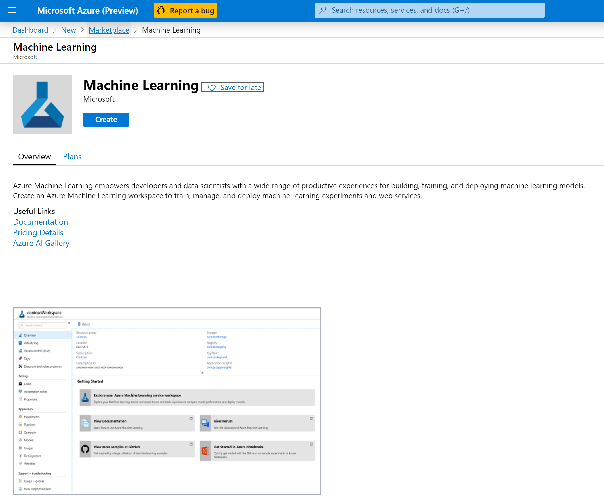

Once you have created an instance of Azure Machine Learning, select 'Launch Azure Machine Learning studio':

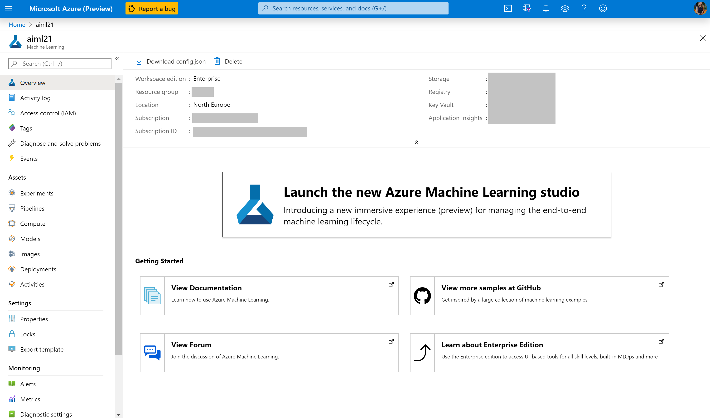

## Azure Machine Learning designer

### Case description: Cheers

In this case, you want to predict the quality of wine. We used a dataset from UCI Machine Learning repository that contained 6497 observations with physicochemical properties of red and white Portuguese wine and their quality (Cortez).

### Azure Machine Learning designer

With the Azure Machine Learning designer, developers and data scientists can quickly build, test, develop, deploy, and consume predictive models using state-of the art machine learning algorithms in an interactive visual workspace.

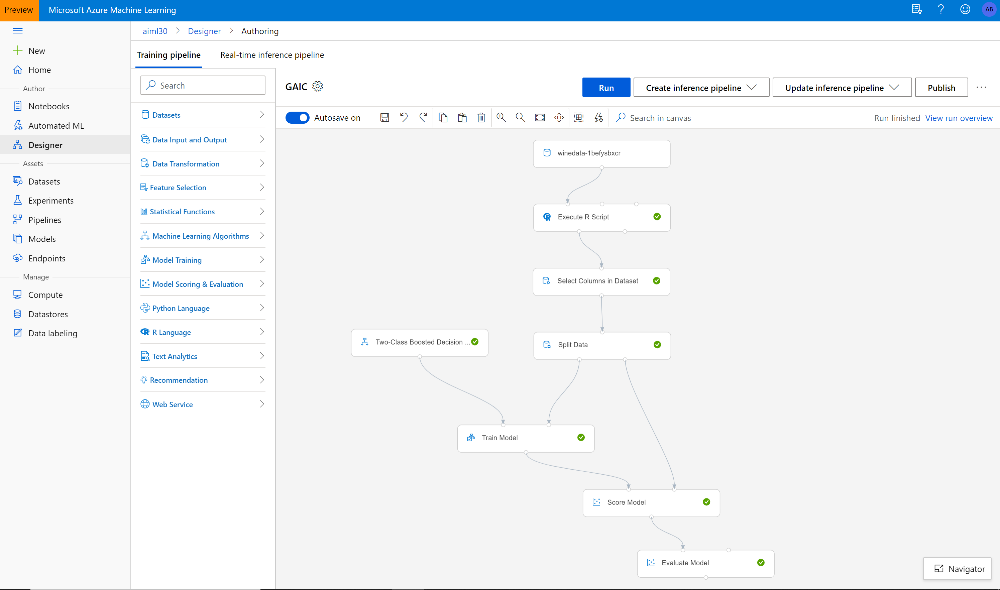

It is organized as follows:

* Experiments: a list of experiments that you have created.
* Web Services: a list of experiments that you have published as a web service.
* Datasets: the datasets that you have uploaded and a list of sample datasets.

In order to develop a predictive model, you will need the data. This can come from various sources. Furthermore, you probably want to transform and analyse the data before you can use it to train the model. Therefore, this visual interface contains several components: the modules. In this case study, you will use several of these components.

### Components of an Experiment

* **Datasets:** contains your uploaded datasets, as well as the provided samples
* **Data Input and Output:** contains the modules to enter the data manually, export the data, or import the data
* **Data Transformation:** contains the modules to manipulate, sample and split, and scale and reduce the data
* **Machine Learning Algorithms:** contains the modules relating to regression, classification and clustering algorithms you can use
* **Model Training:** contains modules to train your algorithm
* **Model Scoring & Evaluation:** Ability to score and evaluate your model performance
* **Python Language Modules:** contains the modules to create a Python model, and the execute Python script
* **R Language Modules:** contains the module to execute R script
* **Text Analytics:** contains the modules to extract n-gram features, feature hashing, and to preprocess text.
* **Web Services:** contains the modules to define the input and output ports of you model.

## Data Science Lifecycle

### Business Understanding

In this part of the lifecycle, there are two main goals. First, you have to define the objectives, and second you have to identity data sources.

To define the objectives, you have to identify the business problem first. An important part of defining the objective, is defining the target variable, or dependent variable, and identifying key variables. To find key variables, we highly recommend you to look at the existing body of knowledge regarding your objective. You are probably not the first person that has this problem. Based on that, you can formulate business goals by defining "sharp" questions that are relevant, specific, and unambiguous, which you can answer with the key variables that you identified.

Then you are ready to identify our data sources, containing the prior defined target and key variables.
Although in this case you work with a sample dataset, it is always a nice exercise to elaborate these steps for yourself, although in real life you would work with your customer and other stakeholders.

**Case:** Regarding the wine quality, you would like to understand whether you could predict the quality of the wine, or if the wine is good or bad. For now, you only want to know whether a wine is good or not. And by good we mean a quality score of 6 or higher. By creating such a model, you could predict the quality based on the physicochemical properties by taking a sample, and hence adapt i.e. the price.

### Data Acquisition and Understanding

In this part of the lifecycle, there are two main goals. First, you want to produce a clean, high-quality data set with the key variables and the target variables. Make sure that the location of the data set is in such way, that you are ready to access it.

Secondly, it’s time to start thinking about a solution architecture of the data pipeline. Because in order to obtain such clean, high-quality data set, you will have to ingest and clean the data programmatically to make it repeatable. And for future steps, you also want to make sure that new data is processed the same way, maybe engineer features, and score your data set by your -yet to be developed- models. Finally, you want to store your results and share them with your customer.

#### Data Acquisition

You start with ingesting the data, for which you have three options:

* Upload a dataset
* Enter data manually
* Import data

Once you have the data, you can start inspecting it, and start the pre-processing part to obtain a clean, high-quality data set.

We obtained the data from the UCI Machine Learning repository website and combined the red and white datasets. This file 'winedata.csv' can be found in the GitHub repo [Wine Quality: Data ingest and exploratory data analysis](https://github.com/mdragt/WineQuality) that can be used for this workshop. The dataset will be prepared so you can upload it to the Azure Machine Learning designer.

*Note: this dataset is from a GitHub repo, meaning that it might be updated every now and then.*

To upload the dataset:

* You will be in the [Azure Machine Learning studio](http://ml.azure.com)
* Click on 'Datasets'
* 'Create dataset' and then 'from local files'
* Browse and select the downloaded Wine Quality dataset from above and choose Next
* Keep all the settings as default and choose Next
* Next again
* Then finally click Create

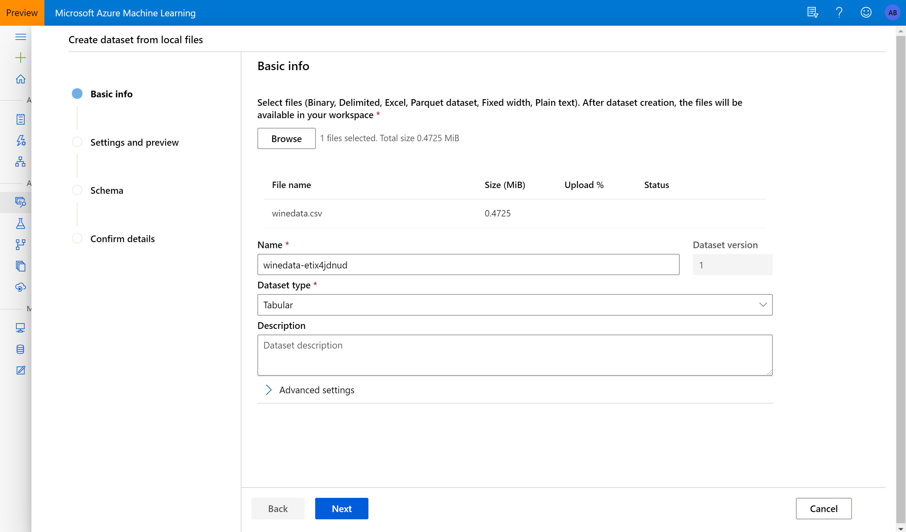

Now you are going to create a new experiment.

* To start a new experiment, click 'Designer' on the left navigation
* Select the plus icon (+) with 'Easy-to-use prebuilt modules' text
* Once the designer is open to your workspace - rename the experiment in the Settings pane

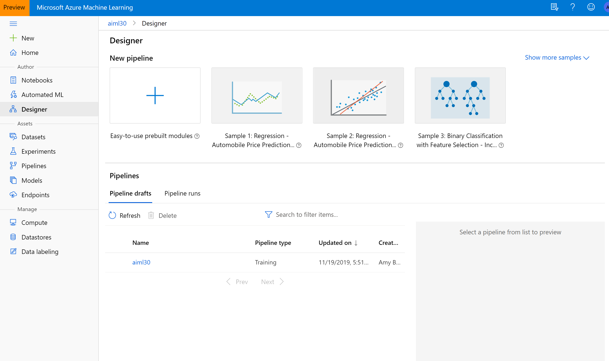

Finally we need to create/assign some compute for the experiment to run on.

* In the Settings pane, select 'Select compute target'
* Choose 'Create new'
* Use the predefined recommended compute and provide a compute name, for example 'trainingcompute'
* Choose 'Save'
* Close the Setting pane

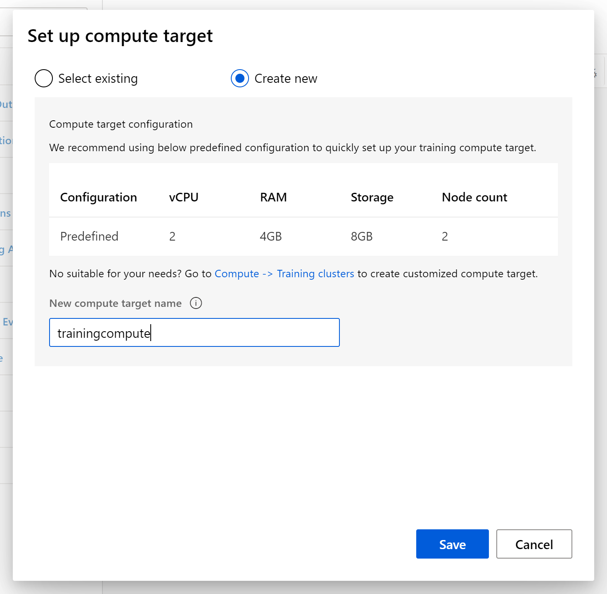

As you have uploaded the dataset, you can now find it under Datasets. Drag it on the canvas.

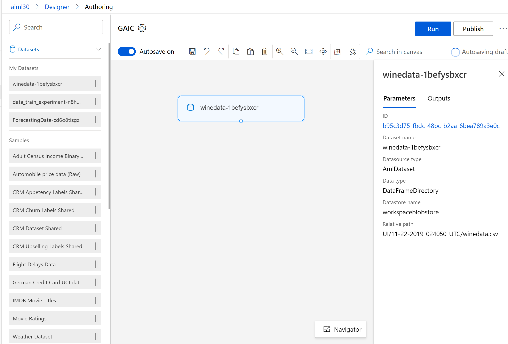

#### Understanding the data

You have various options to inspect the data. First, you could use the “visualize” option to get a generic idea of the data. In the preparation of the dataset, some data visualizations are included, as you are very flexible to program your own graphs. But you have also the option to inspect the data you have dragged on the canvas. 

To visualize the data select the module, on the right window select 'Outputs and then the graph visual to view your dataset

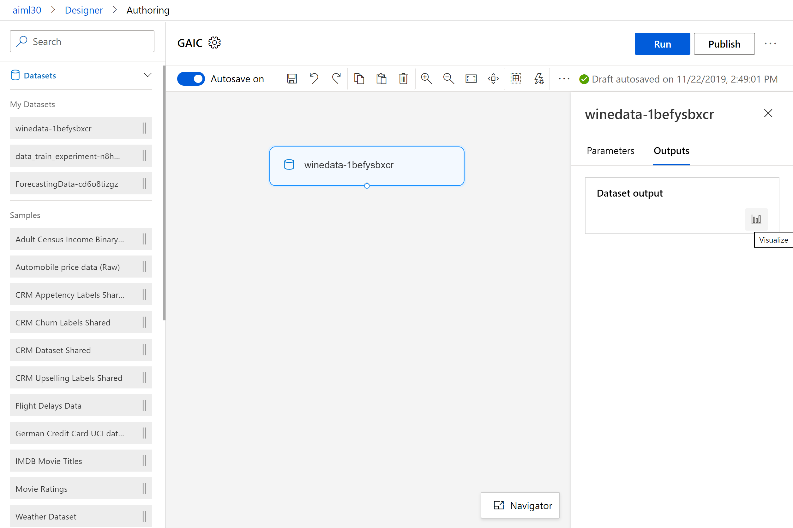

This will give you an interactive overview of your data with standard statistics like mean, median, standard deviation, missing values, unique values, and the data type. Besides, it gives you information about the distribution, using a bar chart, or a boxplot.

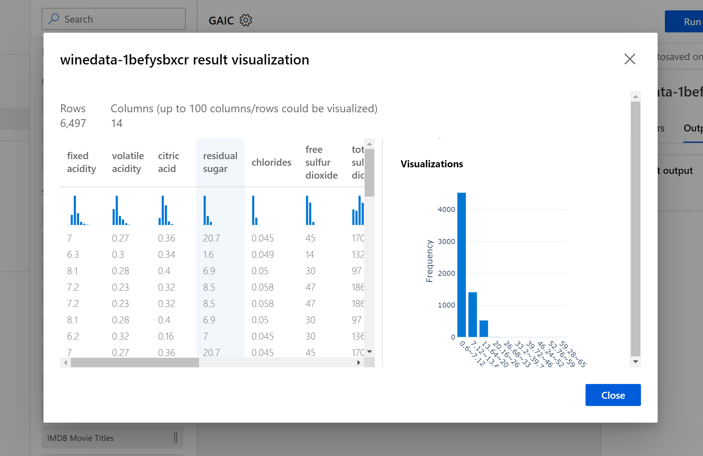

In this case, we show the distribution of “quality”.

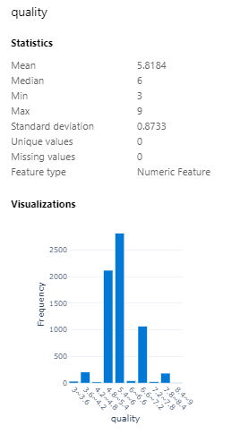

### Modeling

In this part of the lifecycle, there are three main goals. First, you want to determine which are the optimal data features for the machine-learning model. Secondly, you want to create an informative machine learning model that predicts the target variable most accurately. And finally, you want to create a machine learning model in such way, that's suitable for production.

In order to find the optimal data features, you will focus on feature engineering. Feature engineering involves the inclusion, aggregation, and transformation of the key variables to create the features that you can use to predict your target variable with. It can be discussed whether this step takes place in the visual interface, or before, in the prior step.

In order to create an informative machine learning model, you have to train a model with a specific algorithm. This algorithm depends on the type of question you are trying to solve.

Before you train the model, you will split the data into a training and a test data set. You will train the model with the training data set only.

In order to decide whether our model is suitable for production, you will use the test data set and score it with our trained model. You can now evaluate how well our model did.

#### Feature Engineering

During the data preparation, we already created the variable “color” as we are dealing with white and red wine. Now you will also create our dependent variable, based on “quality”. In this case, you are interested to find out whether the wine is good (quality is equal or higher than 6) or bad (quality lower than 6). You can create this new variable with either the Execute Python Script or Execute R Script. We used the latter. This module already contains a preformatted function azureml_main.

*Note: this is just to show you the possibilities of the visual interface, as the variable “qual_bool” already exists in the dataset.*

* Drag the Execute R Script on the canvas and connect it to the dataset module
* Substitute the preformatted code with the code below
* Now we will run the experiment to execute the code and review the output
  * In the top right select the 'Run' button
  * Under 'Experiment' select the drop down and '+ New experiment'
  * Enter an experiment name, example: GAIbootcamp
  * enter a description if you wish for the run
  * Acknowledge your compute target selected
  * Click 'Run'

```r

# R version: 3.5.1
# The script MUST contain a function named azureml_main
# which is the entry point for this module.
azureml_main <- function(dataframe1, dataframe2){
  print("R script run.")
  dataframe1$qualityBool <- ifelse(dataframe1$quality<6,0,1)
  # Return datasets as a Named List
  return(list(dataset1=dataframe1, dataset2=dataframe2))
}

```

Now you have a Boolean that contains a 1 when the original quality of the wine was 6 or higher, and 0 if the quality was below that level.

In the next step you have to remove the original quality variable. Therefore, use the Select Columns module, and exclude the quality variable.

* Drag the 'Select Columns in Dataset' on to the canvas and connect it to the Execute R Script module
* On the right panel select 'Edit column'
* Select the 'By name' and under available columns select Add all
* Then choose the minus (-) button for “quality” and “qual_bool”
* Click 'Save'
* Run experiment
  
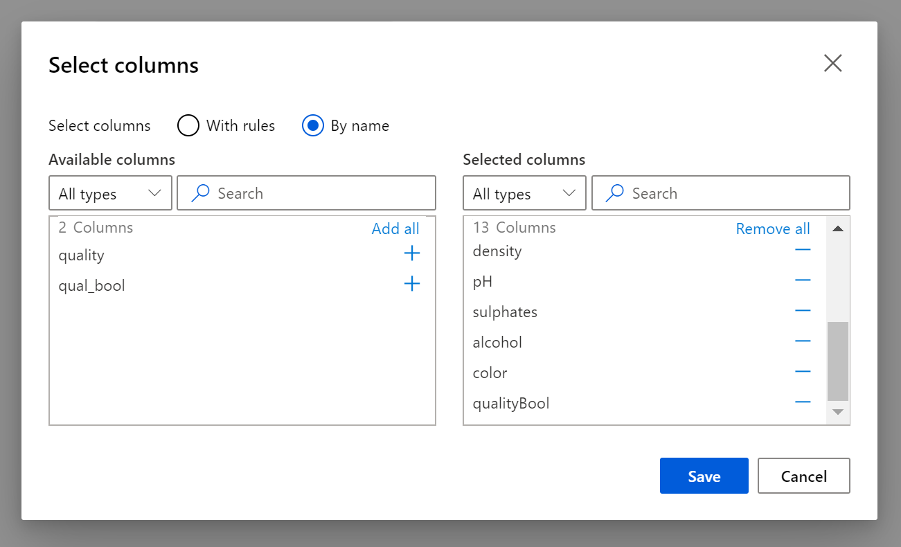

If you now inspect the dataset, you will see that you don’t have the original dependent variable quality anymore. As from now, you will focus on the newly created dependent variable qualityBool.

#### Splitting the data

Now you are ready to split the data in 70% for the training data, and 30% for the testing data. You are also taking the color of the wine into account.

* Drag the Split Data module on the canvas and connect it to the Select Columns in Dataset module
* Select Split Rows as Splitting mode
* Enter 0.7 to create a training dataset containing 70% of the data, which will be in the left output port, and 30% of the data for the test dataset, which will be in the right output port
* Use a Randomized split and set Random seed to any number you want to make this split procedure reproducible
* Set the Stratified split to True and select the variable color. This will split the dataset proportionally, taking the variable color into account.
* Run the experiment

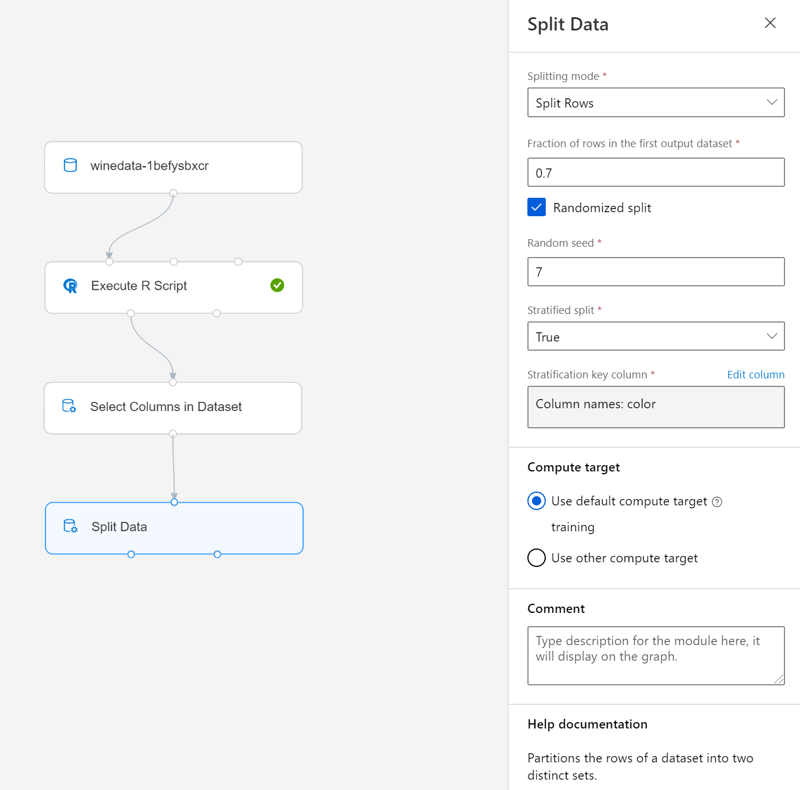

As a result, you now have 70% of your data for testing coming from the left output port (1) and 30% of your data for testing coming from the right output port (2). If you check both datasets, you will see that the original distribution of the variable color has been maintained.

#### Train the model

With the training data, you will now train the model. You have to choose an algorithm and in this case we used the Two-Class Boosted Decision Tree.

* Drag the Train Model module on the canvas and connect the right input port to the left output port of the Split Data module, which contains the training data,
* Select the variable qualityBool as the dependent variable
* Drag the Two-Class Boosted Decision Tree on the canvas and connect it to the left input port
* Leave the standard hyperparameters as they are, but set a seed to make it reproducible
* Run the experiment

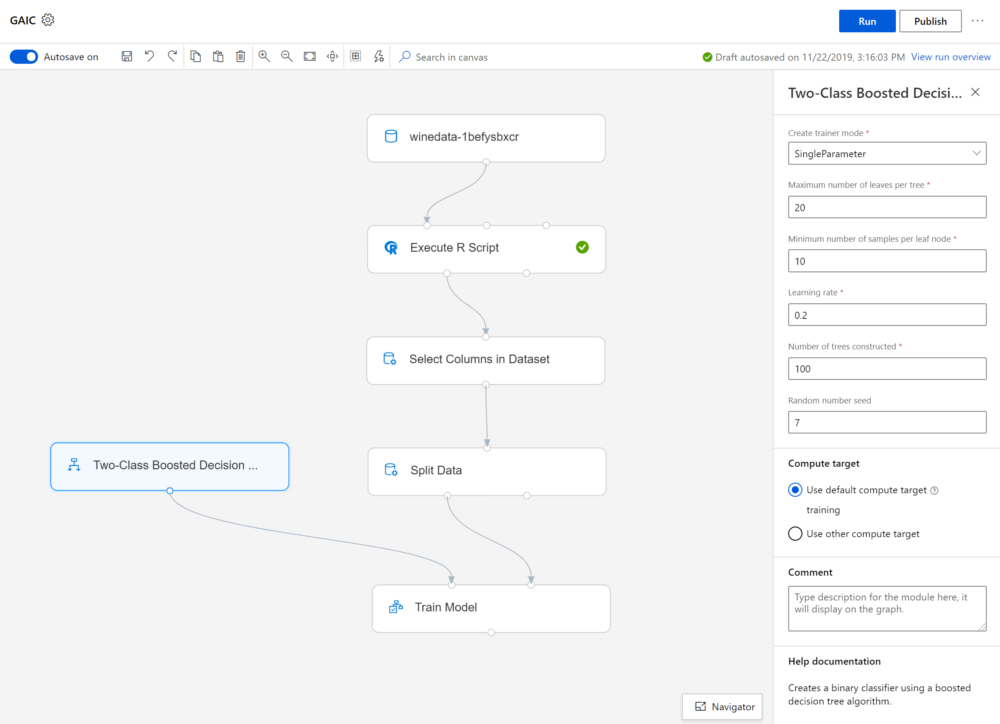

#### Score the test data

With the trained model, you are now ready to score the 30% of the data that you took from the original dataset to test.

* Drag the Score Model module on the canvas and connect the output of the Train model module to the left input port, and the right input port from the Split Data module that contains the test data, to the right input port.
* Run the experiment

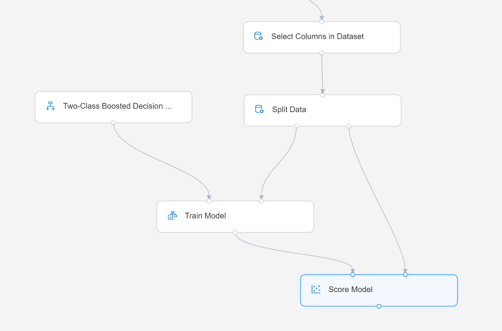

When you visualize the results of this module, you will find two extra columns in the dataset: Scored Labels and Scored Probabilities. When the results of the Scored Probabilities are 0.5 or higher, the Scored labels will be 1, when the Scored Probabilities is lower, the Scored Labels will be 0. In other words, the wines that are predicted as good wines get the label 1, and the wines that are predicted to have a bad quality, get the label 0. Please note that you could of course change this “final prediction” by using a script that uses another threshold as cut-off.

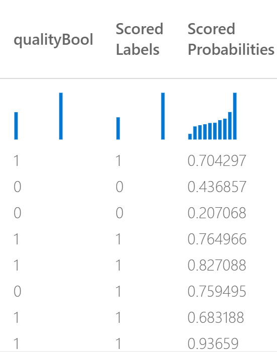

#### Evaluate the model

Now you are ready to evaluate the model that you have trained in combination with the scored testdata.

* Drag the Evaluate Model on the canvas and connect the Score Model module to the left input port of the Evaluate Model module. You can use the right input port to connect it to other model outputs, so you can compare model performance.
* Run the experiment

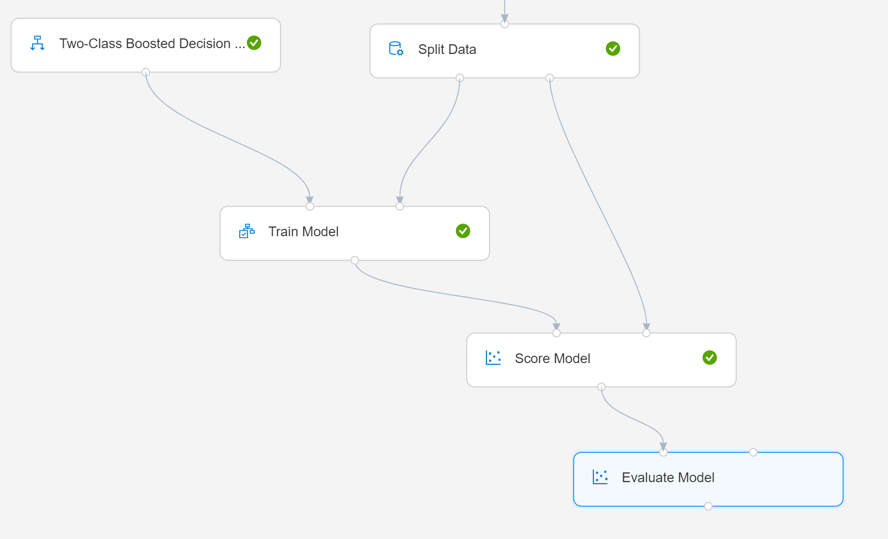

When inspecting the results by using the visualization option, you will get and ROC graph and some performance metrics.

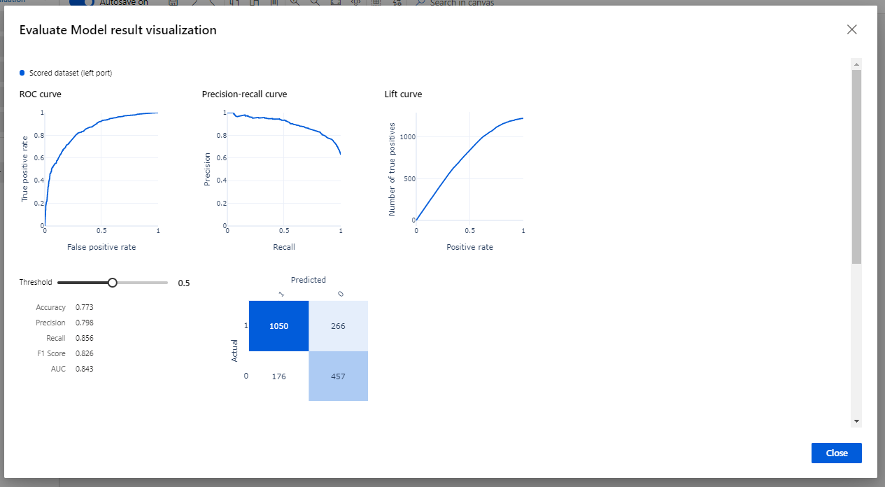

Be critical here: it might be nice to see that you have reached 77% of accuracy here, but always go back to your original dataset and ask yourself the question whether this accuracy score is better that “just” applying the central measures of tendency.

### Deployment

In this part of the lifecycle, there is one main goal. You want to deploy our prior developed model, with a data pipeline to a production or production-like environment for final user acceptance.

#### Create a Predictive Experiment

When you are satisfied with your model quality, you have to option to create an inference pipeline

* Click on 'Create inference pipeline' and choose 'Real-time inference pipeline'. You will be only allowed to click on this button if you have successfully run the experiment.

This will create a new experiment that is linked to your training experiment.

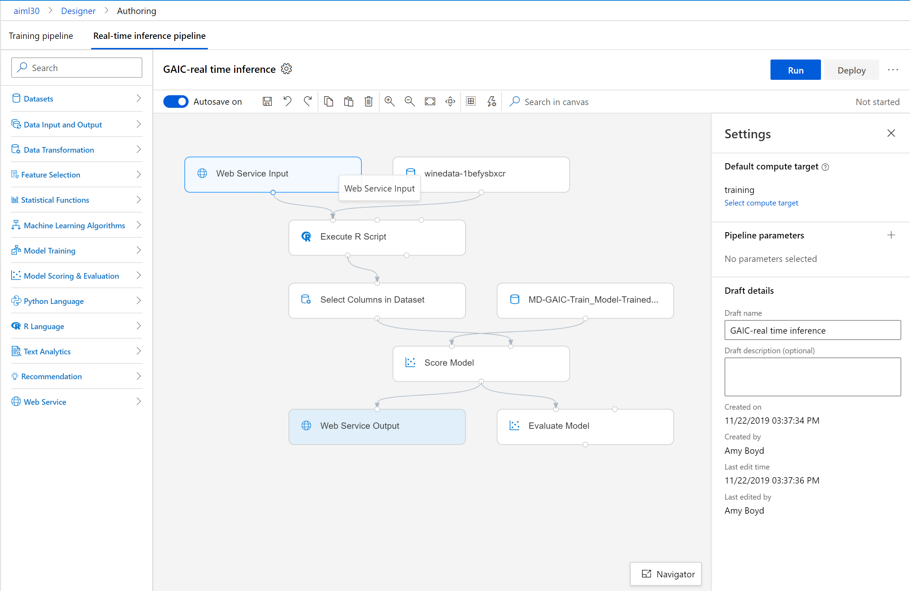

One important step to conduct before you can deploy this model, is eliminating the dependent variable from your model. When you want to make predictions based on new data, this is exactly the variable you don’t have!

* Select the Select Columns from Dataset module
* Enhance the rule, indicating that you also want to exclude the variable qualityBool

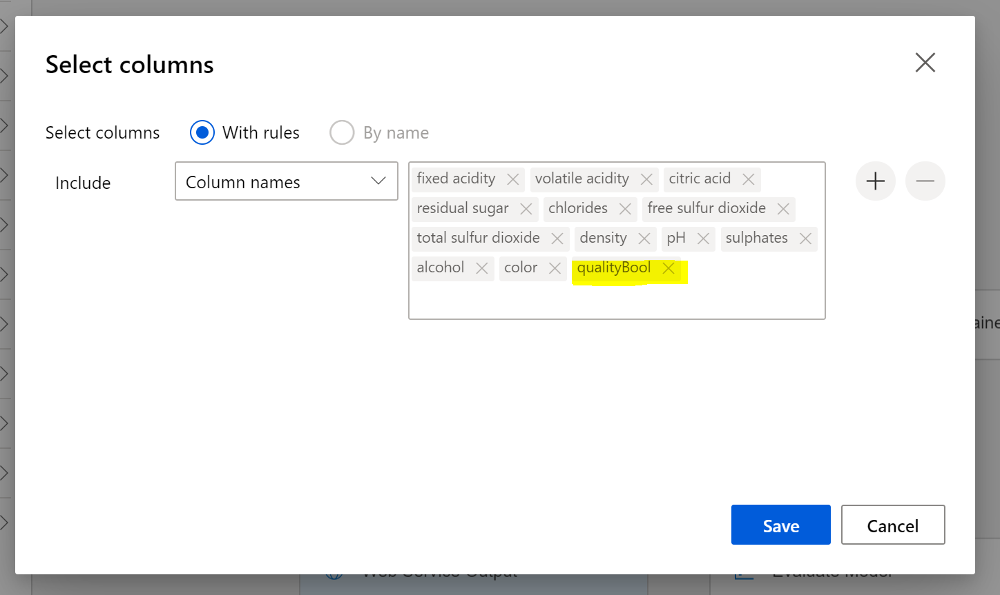

* Connect the Web service input directly to the Score Model module
* Remove the evaluate module
* Run the model

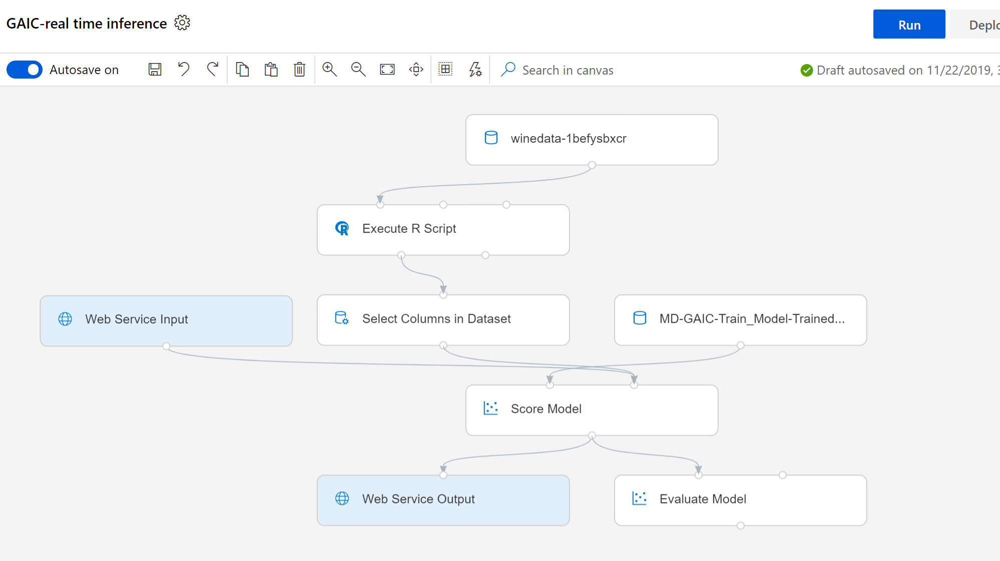

#### Deploy the Web Service

The final step would be the deployment of the model. Just click on the Deploy in the top right, and you are done! Well, almost. For the deployment, you need to create some extra Azure Kubernetes Service (AKS) compute. To find out more on deployment check out the tutorial here: [Tutorial: Deploy a machine learning model with the designer (preview)](https://docs.microsoft.com/en-us/azure/machine-learning/service/tutorial-designer-automobile-price-deploy)

### Customer Acceptance

With this part of the lifecycle, you conclude our story. In this step, you want to make sure that you have finalized the project deliverables and confirm that the pipeline, the model, and their deployment in a production environment satisfy the customer's objectives.

At the end, you have to be able to answer your business objectives from the first step of this lifecycle.

#### Presenting the Prediction Results

Finally, you have to think about our customers. In most cases, you cannot just show them JSON output. In order to present the prediction results, you can collaborate with a developer. And hopefully Microsoft will soon create a connection to Power BI for these models that are deployed with the visual interface too.

## Summary

In this workshop you learned how to build a classification model with the Azure Machine Learning designer.

## Source

### Environment

* [Azure Machine Learning designer](http://ml.azure.com/)
* [Azure platform](<"https://portal.azure.com">)

### Raw data and additional information

Paulo Cortez, University of Minho, Guimarães, Portugal, <http://www3.dsi.uminho.pt/pcortez>
A. Cerdeira, F. Almeida, T. Matos and J. Reis, Viticulture Commission of the Vinho Verde Region(CVRVV), Porto, Portugal
